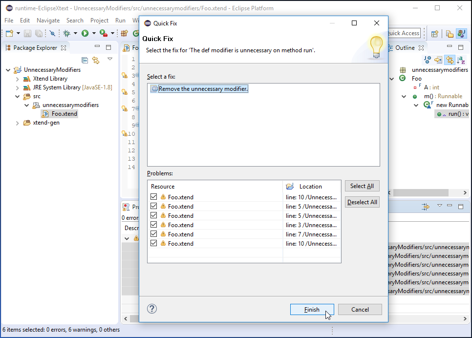

# Xtend 2.14 - Redundant modifiers validation

In the [Xtend](https://www.eclipse.org/xtend/) programming language, the usage of the following keywords/modifiers is unnecessary:

- The 'public' keyword on Xtend classes (class visibility is 'public' by default).
- The 'public' keyword on Xtend interfaces (interface visibility is 'public' by default).
- The 'public' keyword on Xtend enums (enum visibility is 'public' by default).
- The 'public' keyword on Xtend annotatitons (annotation visibility is 'public' by default).
- The 'public' keyword on Xtend constructors (constructor visibility is 'public' by default).
- The 'public' keyword on Xtend methods (method visibility is 'public' by default).
- The 'private' keyword on Xtend fields (field visibility is 'private' by default).
- The 'final' keyword in combination with the 'val' keyword on Xtend fields.
- The 'def' keyword in combination with the 'override' keyword on Xtend methods.

From Xtend 2.14 such redundant modifiers are recognized and corresponding warnings are issued.

The Xtend IDE also provides Quick Fixes to assist the user on fixing such issues: select all the 'Redundant modifiers' warnings on the Problems View to invoke the Quick Fix Dialog either via the Quick Fix Context menu on the Problems View or using the keyboard shortcut `Ctrl + 1`.

After clicking on the Finish button all the 'Redundant modifiers' warnings will be fixed at the same time. Comparing the Xtend code before and after the Quick Fix execution confirms that all the redundant modifiers have been successfully removed.

For ongoing Xtend projects, it could be noisy suddenly having tons of new warnings after updating to a new Xtend version. That's why the severity of the 'Redundant modifiers' can be configured on the Xtend preference page and (wenn desired) can even be completely ignored.

The latest Xtend version can be installed from the [Eclipse Update Site](http://download.eclipse.org/modeling/tmf/xtext/updates/composite/latest/). Give it a try! The Xtext team is always happy about your early feedback!
