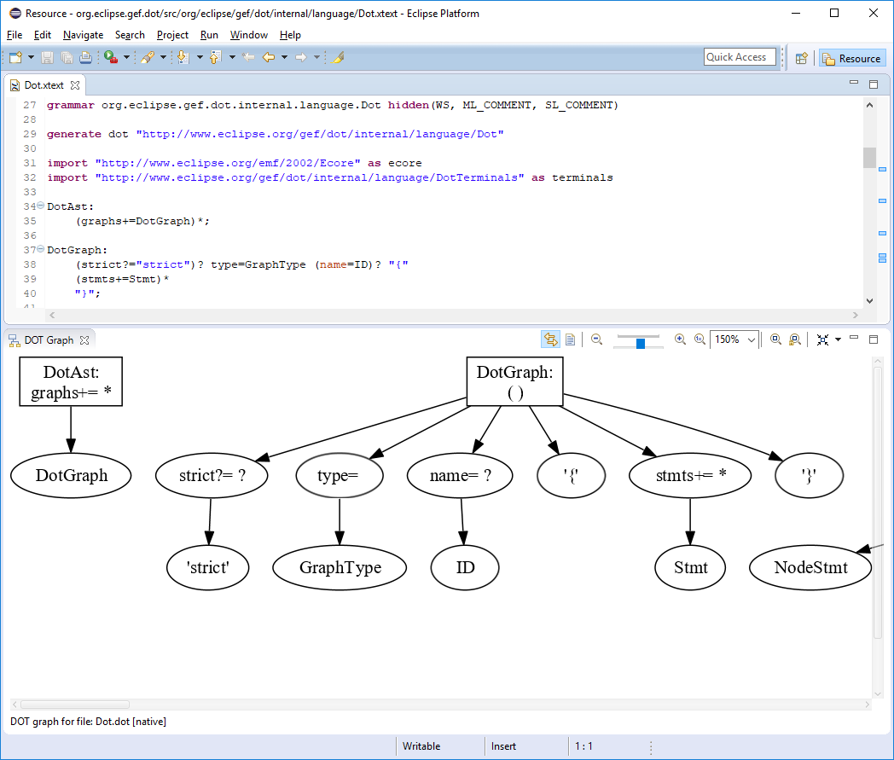
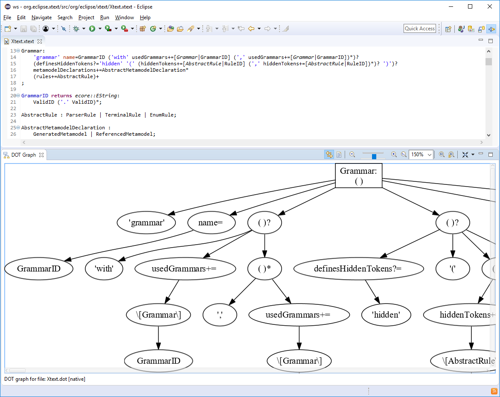

# Visualizing Xtext Grammars with Eclipse GEF

The Xtext Grammar is the central component when developing DSL workbenches based on the [Xtext](https://www.eclipse.org/Xtext/) framework. Such *.xtext files are containing the textual representation of the grammar definitions. In case of complex DSLs, apart from the textual representations, analyzing the graphical representations could be  useful to be able to understand the structure of the defined grammar rules.

Considering the 'Hello World' example of the Xtext framework, the execution of the following JUnit test case
```
package org.xtext.example.mydsl.tests

import com.google.inject.Inject
import org.eclipse.xtext.GrammarToDot
import org.eclipse.xtext.IGrammarAccess
import org.eclipse.xtext.testing.InjectWith
import org.eclipse.xtext.testing.XtextRunner
import org.junit.Test
import org.junit.runner.RunWith

import static extension org.eclipse.xtext.xbase.lib.InputOutput.*

@RunWith(XtextRunner)
@InjectWith(MyDslInjectorProvider)
class GrammarVisualizationTest {

	@Inject extension IGrammarAccess
	@Inject extension GrammarToDot

	@Test def void visualizeGrammar(){
		grammar.draw.println
	}
}
```

converts the [MyDsl.xtext](https://github.com/eclipse/xtext-core/blob/master/org.eclipse.xtext.tests/testdata/wizard-expectations/org.xtext.example.full/org.xtext.example.full.parent/org.xtext.example.full/src/org/xtext/example/mydsl/MyDsl.xtext) grammar into a [Graphviz](http://www.graphviz.org/) dot representation and prints the following content into the console:

```dot
digraph G {
	assignment525968792 [shape=record,label="Model:\ngreetings+= *"];
	rulecall504858437 [label=Greeting];
	group422330142 [shape=record,label="Greeting:\n( )"];
	keyword649329985 [label="'Hello'"];
	assignment1955920234 [label="name= "];
	rulecall1444635922 [label=ID];
	keyword775386112 [label="'!'"];
	assignment525968792->rulecall504858437 [];
	group422330142->keyword649329985 [];
	assignment1955920234->rulecall1444635922 [];
	group422330142->assignment1955920234 [];
	group422330142->keyword775386112 [];
}
```

The [Eclipse GEF](https://www.eclipse.org/gef/) DOT Graph view is able to visualize such Graphviz *.dot files within Eclipse Workbench UI:


The visualization of the Eclipse GEF DOT Xtext grammar ([Dot.xtext](https://github.com/eclipse/gef/blob/master/org.eclipse.gef.dot/src/org/eclipse/gef/dot/internal/language/Dot.xtext)) looks like this:



The visualization of the Xtext grammar itself ([Xtext.xtext](https://github.com/eclipse/xtext-core/blob/master/org.eclipse.xtext/src/org/eclipse/xtext/Xtext.xtext)) is as follows:



And how does the visualization of your Xtext grammar looks like? We hope you will share your solution with us! We are also open to any sugessions on how this Xtext grammar visualization could be improved.

By the way, you can read more about the Xtext Framework in the Xtext FAQ "1001 Tipps & Tricks":
